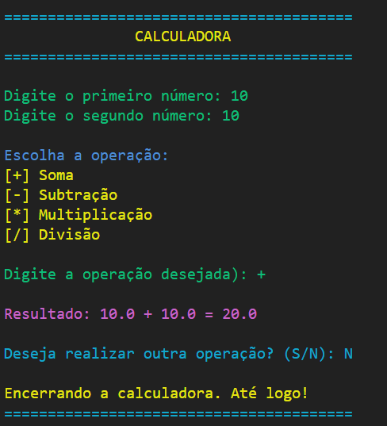

# Calculadora Python

Seja Bem-vindo! 👋 

Este projeto consiste no desenvolvimento de uma calculadora em Python, capaz de realizar as quatro operações matemáticas básicas: *soma*, *subtração*, *multiplicação* e *divisão*.

A aplicação permite ser inserido dois números e escolher da operação desejada. Após exibir o resultado, o usuário pode optar por realizar outra operação ou encerrar o programa.

A interface de interação é simples (via terminal), com estilização de cores para torná-la mais intuitiva.

## Especificações

*Objetivo do projeto:*

Desenvolver uma calculadora em Python que permite realizar operações matemáticas básicas (soma, subtração, multiplicação e divisão) entre dois números.

*Funcionalidade principal:*

O usuário deve ser capaz de inserir dois números e escolher a operação matemática que deseja realizar entre elas.

*Repetição do processo:*

A aplicação deve permitir que o usuário repita as operações quantas vezes quiser, podendo escolher realizar uma nova operação ou repetir uma operação anterior.

*Interação do usuário:*

O usuário pode optar por continuar realizando operações ou encerrar a aplicação, com as seguintes opções:
- Digitar "S" para continuar realizando operações.
- Digitar "N" para sair da aplicação.

  

# Explicação do Código

Na linha 1, é realizado o *import* da biblioteca **Colorama**, seguido pela sua inicialização na linha 4.

Criei uma função principal chamada `calculadora` na linha 7. Adicionei um loop `while` na linha 9 para que a calculadora permaneça em execução.

Nas linhas 11, 12 e 13, adicionei um cabeçalho para organizar melhor a interface da calculadora de forma visual. Também podemos ver a utilização do `Fore.CYAN` e `Fore.YELLOW` para definir a cor do texto.

Na linha 16, adicionei um bloco `try` para capturar exceções no caso de entradas inválidas. Caso ocorra algum erro, ele exibirá uma mensagem de erro e executará o bloco `except ValueError` nas linhas 19 e 20.

Nas linhas 17 e 18, temos duas variáveis `num1` e `num2` do tipo `float` (número com casas decimais), e solicitamos, com o `input()`, a entrada desses números.

Nas linhas 24 a 28, são exibidas as opções de operações para que fique claro qual comando poderá ser informado na linha 31, onde a variável `operador` armazenará o tipo de operação a ser realizada pela calculadora.

Das linhas 34 a 51, utilizei a estrutura de controle `if`-`elif` para verificar as diferentes condições com base no `operador` inserido, e assim, decidir qual operação matemática executar.

A primeira condição, na linha 34: `if operador == "+":`, verifica se o operador inserido é o símbolo de adição (subtração, multiplicação ou divisão). Se for verdadeiro, o programa executa a operação de soma e armazena o resultado na variável `resultado`: `resultado = num1 + num2`.

Na linha 45, adicionei um tratamento de erro para evitar a divisão por zero, já que não podemos dividir um número por zero. Caso isso aconteça, a mensagem "Erro: divisão por zero não é permitida" será exibida. Para finalizar, o bloco `else` trata operadores não esperados, retornando "Operador inválido! Tente novamente."

Finalizando a implementação da calculadora, na linha 54, a resposta do usuário sobre continuar ou encerrar a calculadora é capturada e armazenada na variável `repetir`.

Entre as linhas 56 e 63, temos a condição para encerrar a calculadora ou realizar outra operação. Utilizei as estruturas de decisão `if` e `elif`. Se o usuário escolher "N", o programa encerrará a calculadora; se escolher "S", ele permitirá outra operação. Caso o usuário insira uma entrada inválida, uma mensagem adequada será exibida. Por fim, temos a função `calculadora()`, que encapsula toda a lógica e inicia o processo quando chamada.

# Bibliotecas Utilizadas

- Colorama

# Ferramentas

- Visual Studio Code

# Documentação

[Documentação do Python](https://docs.python.org/pt-br/3/tutorial/index.html)

[Colorama](https://pypi.org/project/colorama/)

______________________

Feito de 💜 por Aline Antunes
